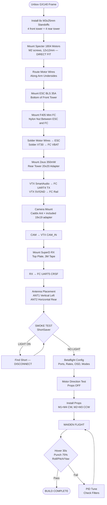

# GX140 3" Analog — Assembly Flow & Checklist
**Builder:** GROK  
**Frame:** GX140 140mm, 4mm carbon, 20×20 twin-tower  
**Target AUW:** <250g

---

## ASSEMBLY FLOW (Mermaid — renders in GitHub/VS Code/Notion)

---

## PRE-FLIGHT PATTERN (Mermaid Gantt)

```mermaid
gantt
    title GX140 Build Timeline
    dateFormat mm
    axisFormat %M min
    
    section Frame
    Unbox & Inspect        :f1, 0, 3m
    Install Standoffs      :f2, after f1, 5m
    
    section Power
    Mount Motors           :m1, after f2, 5m
    Mount ESC              :m2, after m1, 3m
    Mount FC               :m3, after m2, 3m
    Solder Connections     :m4, after m3, 15m
    
    section Electronics
    Mount VTX              :v1, after m4, 5m
    Mount Camera           :v2, after v1, 5m
    Mount RX               :v3, after v2, 5m
    
    section Testing
    Smoke Test             :t1, after v3, 2m
    Betaflight Config      :t2, after t1, 15m
    Motor Direction        :t3, after t2, 3m
    
    section Flight
    Props On               :p1, after t3, 2m
    Maiden Flight          :p2, after p1, 10m
    PID Tuning             :p3, after p2, 30m
```

---

## FITMENT MATRIX (Quick Reference)

| # | Component | Mount Pattern | Frame Match | Verdict | Fix if Needed |
|---|-----------|---------------|-------------|---------|---------------|
| 1 | GX140 Frame | 20×20 twin tower | — | ✅ | — |
| 2 | F405 Mini FC | 20×20mm | 20×20mm | ✅ | — |
| 3 | BLS 35A ESC | 20×20mm | 20×20mm | ✅ | — |
| 4 | Specter 1804 | 12×12mm M2 | 12×12mm M2 | ✅ | Direct fit |
| 5 | Zeus 350mW | 16×16→20×20 adapter | 20×20mm rear | ✅ | Use 20×20 adapter |
| 6 | Caddx Ant | 14×14 / 19×19 adapter | 19mm HD bay | ✅ | Adapter included |
| 7 | SuperD RX | 20×20mm / tape | Top plate | ✅ | VHB tape |
| 8 | XT30 pigtail | Solder to FC | FC VBAT pads | ✅ | — |
| 9 | 2S 550mAh | Strap mount | Bottom plate | ✅ | Anti-slip pad |

---

## POST-BUILD VALIDATION

### Electrical
- [ ] Resistance: Battery + to FC VBAT < 0.1Ω
- [ ] Resistance: Battery - to FC GND < 0.1Ω
- [ ] Continuity: FC TX4 → VTX SmartAudio pad < 0.5Ω
- [ ] Continuity: FC TX5 → RX RX pad < 0.5Ω
- [ ] No continuity between adjacent signal pins
- [ ] No continuity between any pin and carbon frame

### Mechanical
- [ ] All 8 standoffs tight (hand + 1/8 turn)
- [ ] All 16 motor screws tight
- [ ] No loose wires in prop arc
- [ ] VTX antenna SMA tight
- [ ] Battery strap holds pack without shifting
- [ ] Camera angle set and locked

### Software
- [ ] Betaflight 2025.12 firmware
- [ ] DShot600 protocol
- [ ] Bidirectional DShot ON
- [ ] RPM filter ON (3 harmonics)
- [ ] Dynamic notch ON (100-600Hz)
- [ ] UART4: VTX (SmartAudio) at 115200
- [ ] UART5: Serial RX (CRSF) at 420000
- [ ] OSD elements positioned and visible
- [ ] Failsafe: Stage 1 = 1.5s hold, Stage 2 = Drop
- [ ] ARM angle limit = 180° (any angle)

### Flight
- [ ] Hover rock solid, no drift
- [ ] Punch-out clean, no oscillations
- [ ] Roll/Pitch stops clean, no bounce
- [ ] Yaw responsive, no wag
- [ ] Video clear, no lines in throttle
- [ ] RSSI/LQ stable (≥90 LQ at close range)
- [ ] Flight time ≥4 min on 2S 550mAh
- [ ] Motor temp post-flight < 50°C
- [ ] ESC temp post-flight < 60°C
- [ ] Battery voltage post-flight > 3.5V/cell